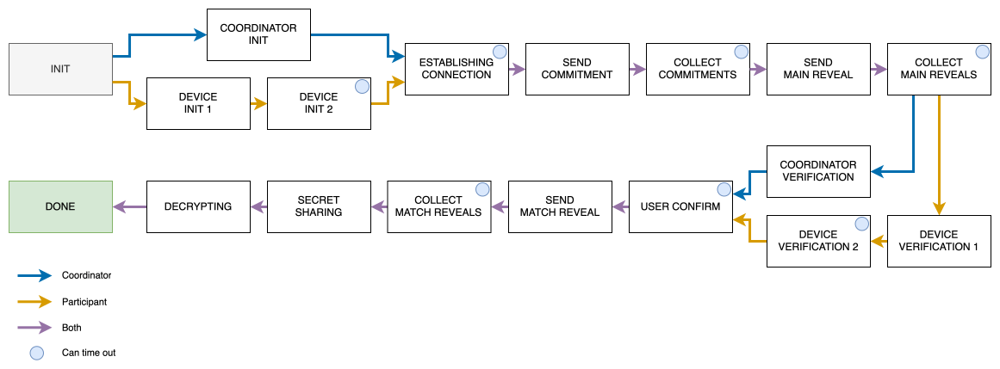

# PairSonic

PairSonic uses the audio channel alongside WiFi-Direct connections to exchange contact data and guarantee authenticity and confidentiality. PairSonic's protocol is based on the [SafeSlinger](https://doi.org/10.1145/2500423.2500428) protocol. All of the corresponding code is located in the [lib/features/pairing/audio/](../lib/features/pairing/audio/) directory. The central file where the protocol is implemented is [grouppairing_protocol.dart](../lib/features/pairing/audio/grouppairing_protocol.dart).

In short, the protocol does the following:
1. Users have either the role of *coordinator* or *participant*. There must always be exactly one coordinator in a pairing process.
2. All *participants* start listening for audio messages.
3. The *coordinator* opens a WiFi-Direct network and plays an audio sequence containing the connection information, such as SSID and passphrase.
4. The *coordinator* and *participants* exchange their commitments, containing encrypted profile data (in our case: name, bio and profile picture), a public key, and other data.
5. The *coordinator* calculates a checksum of all exchanged messages and transmits an audio sequence containing the first bytes of the checksum, which is checked by the *participants*.
6. If everything checks out, all the devices show a blue lock icon, which has to be approved by the users.
7. The devices perform a group Diffie-Hellman key exchange in order to derive a shared secret that is used to decrypt the key with which the profile data has been encrypted.

## Internal states

The states of the PairSonic protocol are visualized below:

## Remarks

The coordinator starts listening for audio messages before transmitting the initial connection message and only stops listening after the user approved the blue lock icon. 
During that time, the coordinator keeps track of which messages it has transmitted and compares them to the list of messages that have been received via the audio channel.
If the coordinator received a message that it hasn't transmitted before, a security alert is raised.